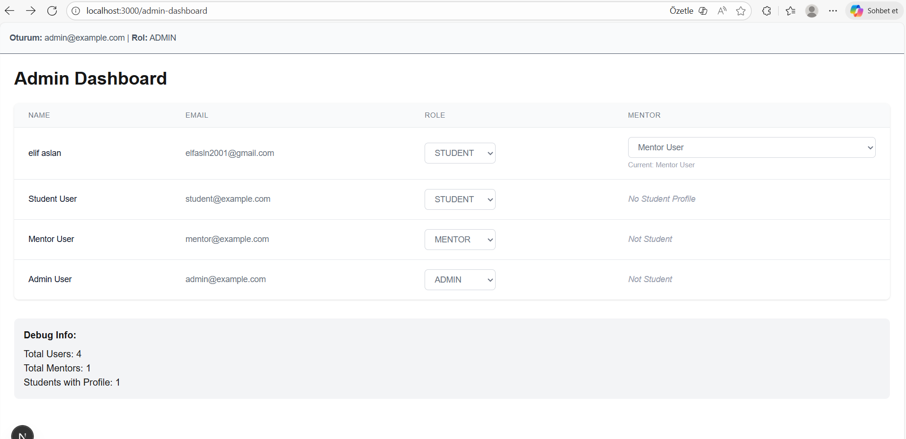
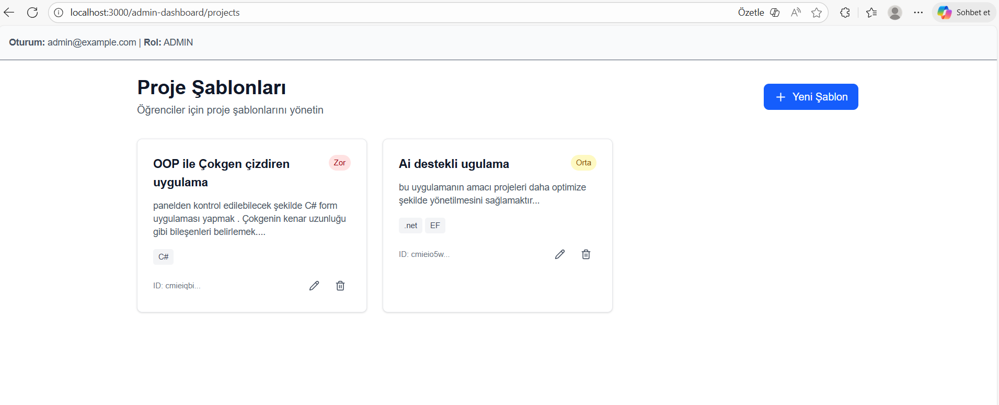
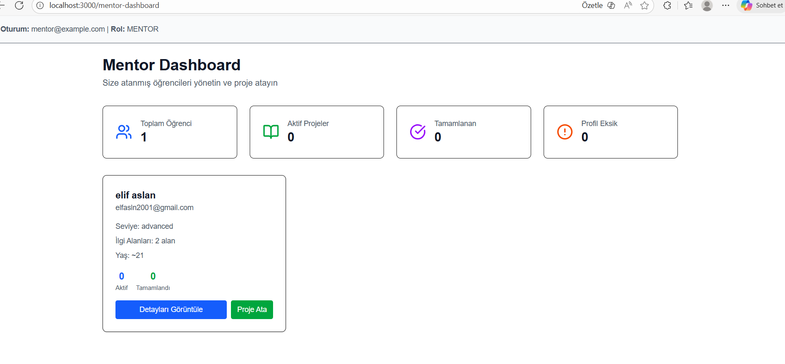
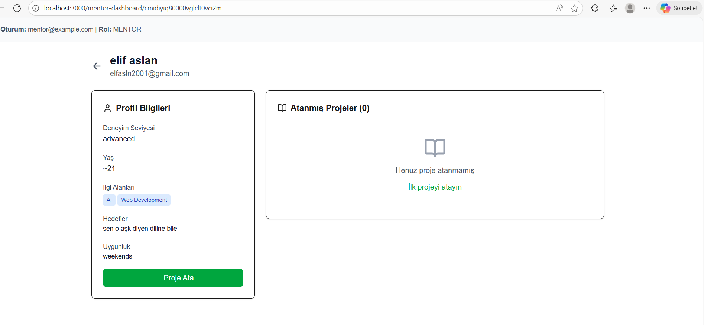

## AISigner

AISigner, stajyer/öğrencilerin kısa bir anketle güçlü yönlerini ve seviyelerini belirleyip uygun mentörle eşleştiren; proje havuzundan uygun bir proje atandıktan sonra AI destekli bir öğrenme yol haritası (roadmap) oluşturan açık kaynak bir platformdur.

## Amaç (MVP)
- Öğrencinin kayıt + anket süreci
- AI ile temel profil çıkarımı (seviye / yatkın alanlar)
- Admin’in mentör ataması
- Mentörün proje havuzundan öğrenciye proje ataması
- AI destekli roadmap üretimi ve adımların onaylanması
- GitHub fork/PR akışına dayalı çalışma düzeni (bkz. "GitHub Entegrasyonu — Mevcut Durum")

### GitHub Entegrasyonu — Mevcut Durum

- ✅ Proje şablonlarına GitHub repository URL'i eklenebilir (admin, `ProjectTemplate.githubRepoUrl`).
- ✅ Roadmap adımlarına GitHub issue linki eklenebilir (mentor, `RoadmapStep.githubIssueUrl`); öğrenci roadmap üzerinde bu linki görür.
- ❌ Henüz **yok**: otomatik fork/PR oluşturma, issue durumu senkronizasyonu, webhook/GitHub App entegrasyonu. Şu an akış tamamen link-bazlı ve manuel — öğrenci/mentor repo ve issue linklerini elle takip eder.

## Ön Gereksinimler

Projeyi kurmadan önce sisteminizde aşağıdaki yazılımların kurulu olduğundan emin olun:

- **Node.js** (v20 veya üzeri — CI de bu sürümü kullanıyor)  
- **npm** (Node.js ile birlikte gelir)  
- **Docker** & **Docker Compose**  
- **Git**


##  Hızlı Kurulum

> 1. `git clone https://github.com/Posinowa/AISigner.git`  
>    → Projeyi kendi bilgisayarına indir.

> 2. `cd AISigner`  
>    → Proje klasörüne geç.

> 3. `docker compose up -d`  
>    → PostgreSQL veritabanını arka planda başlat.

> 4. `.env` dosyasını oluştur  
>    → Ortam değişkenlerini `.env.example` dosyasına göre tanımla (örnek: `DATABASE_URL`, `AUTH_SECRET` — NextAuth v4'ün beklediği değişken adı budur, `NEXTAUTH_SECRET` değil).

> 5. `npm install`  
>    → Proje bağımlılıklarını yükle (Next.js, Prisma, Argon2 vb.)

> 6. `npx prisma migrate deploy` ardından `npx prisma generate`  
>    → Repoda hazır bulunan tüm migration'ları veritabanına uygula ve Prisma Client'i üret. (`migrate dev` yalnızca schema.prisma'da yeni bir değişiklik yapıp yeni migration üretirken kullanılır; mevcut projeyi ilk kez ayağa kaldırırken `deploy` doğru komuttur.)

> 7. `npm run seed`  
>    → Demo verisini oluştur: admin/mentor/student kullanıcıları, student'ın mentor'a ataması ve örnek proje şablonları (idempotent — tekrar çalıştırmak duplicate üretmez, bkz. "Seed Nasıl Çalıştırılır?").

> 8. `npm run dev`  
>    → Uygulamayı başlat (`http://localhost:3000` adresinde çalışır).


---

## Outplane Deploy

### 1) Outplane'de PostgreSQL oluştur

- `Create Database` -> `PostgreSQL`
- Örnek ad: `aisigner-db`
- Bölge: kullanıcı kitlene en yakın bölge (TR için Frankfurt uygun)
- Oluşan connection string'i kopyala

### 2) Uygulamayı repo'dan deploy et

- Outplane `Deploy New Application` ekranında `Public Repo` seç
- Repo URL'sini gir (kendi fork'un veya ana repo)
- Build yöntemi olarak `Dockerfile` seç
- Port: `3000`

Bu repo Outplane için gerekli Docker dosyalarıyla birlikte gelir:

- `Dockerfile`
- `.dockerignore`

Container başlangıcında migration otomatik uygulanır:

- `npx prisma migrate deploy`

### 3) Environment Variables

Outplane uygulamasına aşağıdaki değişkenleri ekle:

```bash
DATABASE_URL=<outplane-postgres-connection-string>
AUTH_SECRET=<uzun-rastgele-string>
NEXT_PUBLIC_APP_URL=<outplane-app-url>
NODE_ENV=production
PORT=3000
```

AI özelliklerini de production'da kullanacaksan ek olarak:

```bash
GOOGLE_CLOUD_PROJECT=<gcp-project-id>
GOOGLE_CLOUD_LOCATION=us-central1
GOOGLE_APPLICATION_CREDENTIALS=gcp-credentials.json
```

ve `gcp-credentials.json` dosyasını Outplane tarafında güvenli dosya/secret olarak mount etmen gerekir.

### 4) İlk doğrulama

- Deploy tamamlanınca `/api/health` endpointini kontrol et
- Gerekirse Outplane terminalinden seed çalıştır:

```bash
npm run seed
```

---

> **NOT:** Seed sonrası test kullanıcıları
 
> | Rol     | Email               | Şifre           |
> |---------|---------------------|-----------------|
>| Admin   | admin@example.com   | geçici_şifre    |
>| Mentor  | mentor@example.com  | geçici_şifre    |
>| Student | student@example.com | geçici_şifre    |

> Bu kullanıcılarla `/signin` üzerinden giriş yapabilir, yönlendirme ve layout guard’ları test edebilirsin.

---


## Database Kurulumu — Sorun Giderme

> Adım adım kurulum için yukarıdaki **"Hızlı Kurulum"** bölümüne bakın. Burada yalnızca sık karşılaşılan sorunlar ve doğrulama komutları var. Modellerin güncel/otoriter tanımı için `prisma/schema.prisma` dosyasına bakın — bu dosyanın README'de ayrı bir kopyası tutulmuyor (kopyalar zamanla kodla çelişip eskiyor).

**Docker/veritabanı çalışıyor mu?**
```bash
docker compose ps
```

**Tablolar doğru oluştu mu?**
```bash
docker exec -it aisigner_db bash -c "psql -U postgres -d aisigner -c '\dt'"
```

**Prisma Studio ile görsel kontrol** (`http://localhost:5555`):
```bash
npx prisma studio
```

**Migration/schema uyumsuzluğu yaşıyorsan** (yalnızca lokal/geliştirme ortamında — veri kaybına yol açar):
```bash
npx prisma migrate reset
```

**Test verisi eklemek için** `npm run seed` kullanın (bkz. "Seed Nasıl Çalıştırılır?") — argon2 ile şifreleri güvenli şekilde hash'ler. Elle `INSERT` ile düz metin şifre eklemeyin.

## Seed Nasıl Çalıştırılır?
🔹 Seed (Örnek Kullanıcıları Ekleme)

- Bu adımlar, Lokal geliştirme sırasında veritabanına hızlıca test edilebilecek 3 örnek kullanıcı eklemek için kullanılır.Seed script’i idempotent çalışır, yani aynı script tekrar tekrar çalıştırıldığında kullanıcılar çoğalmaz.

- Şifreler güvenli şekilde **argon2** ile hashlenir.
- Prisma Client kullanılarak veritabanına bağlantı sağlanır.


**Seed Script Çalıştırma**

Seed’i çalıştırmak için terminalden proje klasöründe şu komutu çalıştır:
```
npm run seed
```

Script çalıştığında terminalde şöyle bir çıktı görürsün:

```
✅ ADMIN user created: admin@example.com
✅ MENTOR user created: mentor@example.com
✅ STUDENT user created: student@example.com
Seed process completed! 3 users added!
```

## Kimlik Doğrulama (NextAuth)

Bu projede kimlik doğrulama altyapısı NextAuth ile kurulmuştur. Prisma adapter kullanılarak session verileri veritabanında saklanır. Cookie ayarları `SameSite=Lax` olarak tanımlanmıştır.

Dosya: `src/lib/auth/nextauth.ts`

## Healthcheck
 Veritabanı bağlantısını test etmek için:
 
*Tarayıcıda*: `http://localhost:3000/api/health`

 veya

*Terminalde*:
```
curl http://localhost:3000/api/health
```

**Beklenen çıktı**:
```bash
{
  "status": "ok",
  "db": "connected",
  "timestamp": "2025-09-03T21:44:00.000Z"
}
```
 Eğer veritabanı bağlantısı koparsa, status: "error" ve db: "disconnected" döner.


***GET /api/health***

Bu endpoint `SELECT 1` sorgusu ile bağlantıyı kontrol eder.

- `200 OK` → Bağlantı sağlıklı  
- `500 ERROR` → Bağlantı başarısız

## M2 – Öğrenci Onboarding & Profil Özeti

Bu modül, öğrencinin kayıt sonrası onboarding sürecini ve profil özetini yönetir.

###  *Dosya Yapısı*

- `features/student/ui/OnboardingForm.tsx` → Çok adımlı form bileşeni
- `features/student/models/onboarding.ts` → Zod doğrulama şemaları
- `features/student/server/onboarding.ts` → `saveOnboarding(data)` server action
- `features/student/server/profileSummary.ts` → AI profil analizi (`getProfileSummary`) + yedek mock fonksiyonu (`getMockProfileSummary`)
- `features/student/ui/ProfileSummaryCard.tsx` → Profil özeti bileşeni
- `app/(student)/student-dashboard/page.tsx` → Öğrenci dashboard sayfası

###  *Süreç Akışı*

1. Öğrenci `OnboardingForm` üzerinden kişisel bilgilerini, deneyim seviyesini ve hedeflerini girer.
2. Form submit edildiğinde `saveOnboarding()` ile veritabanına `StudentProfile` olarak kaydedilir.
3. Ardından `getProfileSummary()` ile Gemini AI özeti oluşturulur (hata durumunda mock fallback kullanılır).
4. Öğrenci `student-dashboard` sayfasına yönlendirilir ve profil özeti + proje durumu gösterilir.

###  M2 – Uygulama Rehberi

Yeni gelen bir geliştirici aşağıdaki adımları izleyerek M2 sürecini uçtan uca test edebilir:

1. `npm run dev` ile projeyi başlat
2. http://localhost:3000/signin üzerinden test kullanıcısı ile giriş yap:
   - E-posta: `student@example.com`
   - Şifre: `geçici_şifre`

3. Oturum açıldıktan sonra http://localhost:3000/profile-setup sayfasına git. (Eski `/student-onboarding` URL'i hâlâ çalışır ama `/profile-setup`'a kalıcı yönlendirme yapar.)
4. Formu 3 adımda doldur:
   - Kişisel Bilgiler
   - Deneyim Seviyesi
   - Öğrenme Hedefleri
5. “Gönder” butonuna basıldığında veriler veritabanına kaydedilir (`StudentProfile`)
6. Ardından `student-dashboard` sayfasına yönlendirilirsin
7. Dashboard’da:
   - Hoşgeldin mesajı
   - Profil özeti (mock AI ile)
   - Proje durumu (“Henüz proje atanmadı” mesajı)


Onboarding sonrası veriyi doğrulamak için ``` npx prisma studio```  komutuyla veritabanını görsel olarak inceleyebilirsiniz.


### **Mock AI Notu**

>`getProfileSummary()` fonksiyonu Gemini AI ile profil analizi yapar. Hata durumunda `getMockProfileSummary()` yedek fonksiyonu devreye girer.

---
## M3 - Admin & Mentor Temelleri
 Bu modül, admin ve mentor rollerinin temel işlevlerini kapsar: kullanıcı yönetimi, proje şablonu kontrolü ve öğrenci–proje eşleşmesi.

 ---
 ### 1. Yeni Modeller ve İlişkiler (Prisma)

- **User**
  - Roller: `ADMIN`, `MENTOR`, `STUDENT`
  - Mentor–öğrenci ilişkisi:
    - Bir mentorun birden fazla öğrencisi olabilir (`StudentProfile.mentorId` üzerinden).
    - Bir öğrencinin tek mentor ilişkisi vardır.

- **StudentProfile** *(M2’de tanımlandı, M3 ile genişletildi)*
  - Yeni ilişkiler:
    - `mentorId` → Mentor ile bağlantı.
    - `assignedProjects` → Öğrenciye atanmış projeler listesi.

- **ProjectTemplate**
  - Admin tarafından tanımlanan proje şablonları.
  - Alanlar: `id`, `title`, `description (md)`, `difficulty (enum: EASY, MEDIUM, HARD)`, `track (string[])`.
  - İlişki: `assignedProjects` ile bağlantılı.

- **AssignedProject**
  - Mentorun, öğrencisine atadığı projeleri tutar.
  - Alanlar: `id`, `studentProfileId`, `projectTemplateId`, `status`.
  - Statü enum: `PENDING`, `IN_PROGRESS`, `COMPLETED`.
  - İlişkiler:
    - `studentProfile` → Öğrenciye bağlı.
    - `projectTemplate` → Proje şablonuna bağlı.

---

### 2. Admin Paneli

**Amaç**  
Admin tüm kullanıcıları görüntüleyebilir, rollerini değiştirebilir ve mentor ataması yapabilir.

**Dosya Yapısı**  
- Dosya:`src/features/admin/server/user.ts`  
  - `getAllUsers()` → Tüm kullanıcıları ve ilişkili profil bilgilerini döndürür.  
  - `getMentors()` → Sadece mentor rolündeki kullanıcıları listeler.  
  - `updateUserRole(userId, role)` → Kullanıcının rolünü günceller.  
  - `assignMentor(studentId, mentorId)` → Öğrenciye mentor atar.  
- Dosya:`app/(admin)/admin-dashboard/page.tsx` → Admin UI  


**Gerçekleştirilenler**
- Kullanıcı listesi tablosu.
- Rol değiştirme butonu.
- Mentor atama dropdown.
- Değişiklikler Prisma üzerinden anında DB’ye yansır.

---

### 3. Admin – Proje Şablon Yönetimi

**Amaç**  
Admin proje şablonu ekleyebilir, güncelleyebilir, silebilir, listeleyebilir.

**Dosya Yapısı**
- Dosya: `src/features/projects/server/templates.ts`
- Fonksiyonlar:
  - `listTemplates()` → Tüm şablonları listeler (createdAt desc).
  - `createTemplate(data)` → Yeni şablon oluşturur.
  - `updateTemplate(id, data)` → Şablonu günceller.
  - `deleteTemplate(id)` → Şablonu siler.
  - `getTemplateById(id)` → Şablonu id ile getirir.
- Alanlar:
  - `difficulty`: `EASY | MEDIUM | HARD`
  - `track`: `string[]`
  - `description`: Markdown destekli içerik
`
- Dosya: `app/(admin)/admin-dashboard/projects/page.tsx` → UI

**Gerçekleştirilenler**
- Yeni proje ekleme formu.
- Listeleme tablosu.
- Düzenleme & silme işlemleri.
- Açıklama MD formatında saklanır.
- `track` alanı çoklu seçim olarak oluşturuldu.


---

### 4. Mentor Paneli

**Amaç**  
Mentor yalnızca kendi öğrencilerini görebilir ve onlara proje atayabilir.

**Dosya Yapısı**
- Dosya:  `app/(mentor)/mentor-dashboard/page.tsx` → Öğrenci listesi
- Dosya: `app/(mentor)/mentor-dashboard/[studentId]/page.tsx` → Öğrenci profili + proje atama
- Dosya: `features/mentors/server/actions.ts` → `getMentorStudents()`, `getStudentDetail()`, `assignProjectToStudent()`, `updateProjectStatus()`

**Gerçekleştirilenler**
- Mentor dashboard’da yalnızca kendi öğrencileri listelenir.
- Öğrenci detay sayfasında profil bilgileri ve proje şablonları gösterilir.
- “Projeyi Ata” butonu → `AssignedProject` kaydı oluşturur.
- Öğrencinin dashboard’unda proje listesi görünür.


### Süreç Akışı

1. Admin dashboard üzerinden tüm kullanıcıları görür.  
2. Kullanıcının rolünü veya mentorunu güncelleyebilir.  
3. Admin proje şablonlarını ekleyip düzenleyebilir.  
4. Mentor dashboard’da sadece kendisine atanmış öğrencileri görür.  
5. Öğrenci detayına girip uygun projeyi seçer ve atar.  
6. Atanan proje öğrencinin dashboard’unda görünür.  


---

### M3 – Uygulama Rehberi

Yeni gelen bir geliştirici aşağıdaki adımları izleyerek M3 sürecini uçtan uca test edebilir:

1. `npm run dev` ile projeyi başlat.  
2. [http://localhost:3000/signin](http://localhost:3000/signin) üzerinden **admin** veya **mentor** hesabı ile giriş yap.  

#### Admin için:
- [http://localhost:3000/admin-dashboard](http://localhost:3000/admin-dashboard)  
  - Kullanıcı listesi tablosunu görüntüle.  
  - Rol değiştirme butonunu test et.  
  - Öğrenciler için mentor atama dropdown’unu kullan.  
 


- [http://localhost:3000/admin-dashboard/projects](http://localhost:3000/admin-dashboard/projects)  
  - Yeni proje şablonu ekleme formunu doldur ve kaydet.  
  - Listeleme tablosunda eklenen şablonun göründüğünü doğrula.  
  - Düzenleme ve silme işlemlerini test et.  
  - Markdown açıklamasının DB’de saklandığını ve UI’da render edildiğini kontrol et.  




#### Mentor için:
- [http://localhost:3000/mentor-dashboard](http://localhost:3000/mentor-dashboard)  
  - Yalnızca kendisine atanmış öğrencilerin listelendiğini doğrula.  
  - Öğrenci detay sayfasına git:  
    - Örn. [http://localhost:3000/mentor-dashboard/{studentId}](http://localhost:3000/mentor-dashboard/{studentId})  
  - Öğrenci profil özetini görüntüle.  
  - Proje şablonları listesinden seçim yap ve “Projeyi Ata” butonuna bas.  
  - Atanan projenin öğrencinin dashboard’unda göründüğünü doğrula.  



#### Öğrenci için:
- [http://localhost:3000/student-dashboard](http://localhost:3000/student-dashboard)  
  - Onboarding sonrası profil özetini görüntüle.  
  - Mentor tarafından atanmış projelerin listelendiğini kontrol et.  

---


## Roller (özet)
- **Admin**: Kayıtlı kullanıcıları görür, mentör atar, proje şablonlarını yönetir.
- **Mentör**: Kendisine atanan öğrenciyi görür, proje atar, roadmap’i onaylar/düzenler.
- **Öğrenci**: Anketi doldurur, atanan projeyi ve görevlerini takip eder, fork/PR akışında çalışır.

## Yüksek Seviyeli Akış
1. Öğrenci kayıt olur ve anketi tamamlar.
2. AI, öğrencinin seviyesini ve yatkın alanlarını çıkarır (özet).
3. Admin, uygun mentörü atar.
4. Mentör, proje havuzundan uygun bir proje seçer.
5. AI, proje + öğrenci profiline göre bir roadmap üretir (mentör onaylar/düzenler).
6. Roadmap adımları GitHub issue/PR döngüsü ile yürütülür.

## Teknik Altyapı
- **Uygulama**: Next.js 15 (App Router), TypeScript, TailwindCSS
- **Sunucu uçları**: Next.js Route Handlers (REST) + Server Actions
- **Kimlik doğrulama**: NextAuth (Credentials provider, JWT strategy)
- **Veritabanı**: PostgreSQL + Prisma ORM
- **AI servisi**: Google Vertex AI (Gemini) — profil analizi, proje önerisi ve roadmap üretimi
- **UI**: shadcn/ui + Radix UI

## Katkı
Detaylı katkı rehberi için [CONTRIBUTING.md](CONTRIBUTING.md) dosyasına bakın.
- Fork → branch → PR akışı ile katkı verin.
- Küçük ve odaklı PR’lar tercih edilir.

## Lisans
MIT

---

## Geliştirme Kuralları ve Mimari İlkeler

**Yaklaşım:** Feature‑based.

```
src/
  app/                         # Next App Router (route segmentleri)
    (public)/                  # kayıt/anket, landing vb.
    (student)/                 # öğrenci alanı
    (mentor)/                  # mentor alanı
    (admin)/                   # admin alanı
    api/                       # (gerekirse) route handlers
  features/
    auth/
      ui/                      # sayfa ve bileşenler (UI-only)
      server/                  # server actions, service, repo katmanı
      models/                  # Zod şemaları, tipler, domain modelleri
      lib/                     # yardımcı fonksiyonlar (yalnızca feature içi)
      hooks/                   # client hooks
      components/              # feature-özel küçük bileşenler
    student/...
    mentor/...
    admin/...
  lib/                         # app-geneli yardımcılar (fetcher, auth guard)
  styles/                      # global css/tailwind
  prisma/
    schema.prisma              # yalnızca veritabanı şeması (Prisma)
```


- **Şemalar (schemas):**
  - **Veritabanı şeması** yalnızca `prisma/schema.prisma` içinde tutulur.
  - **Uygulama/doğrulama şemaları** (Zod) ilgili feature altında `models/` içinde tanımlanır.
- **Dışa Açık API:** Route Handlers → `features/<feature>/server` fonksiyonlarını çağırır. UI bu katmana doğrudan erişmez.
- **İsimlendirme:** Dosya/klsr: kebab-case, React bileşenleri: PascalCase, tip/şema: `PascalCase`, env anahtarları: `SCREAMING_SNAKE_CASE`.
- **İçe Aktarım:** `@/*` alias (mutlak import); feature dışından içeri bağımlılık minimum.
- **Stil/UI:** Tailwind + shadcn/ui. Bileşenler erişilebilirlik (a11y) kurallarına uyar.
- **Durum Yönetimi:** Öncelik server actions; gerekli yerde minimal client state. (İleride React Query opsiyonel.)
- **Güvenlik:** Server-only işlemler Route Handler/Server Action’da kalır; gizli anahtarlar client’a sızmaz. HttpOnly cookie, SameSite=Lax.
- **Kod Kalitesi:** TypeScript strict, ESLint + Prettier zorunlu; küçük ve odaklı PR.
- **Commit/Branch:** Conventional Commits (`feat:`, `fix:`, `chore:`…), branch: `feat/<scope>-kısa-açıklama`.
- **PR Kuralları:** “Ne değişti?” + “Nasıl test edilir?” zorunlu; ekran görüntüsü/gif teşvik edilir.

---
## 📁 Mevcut Proje Yapısı

Uygulama Next.js App Router mimarisiyle yapılandırılmıştır. Dosya sistemi route, rol ve işlev bazlı organize edilmiştir.

```
├── prisma/
│   ├── schema.prisma         # Veritabanı modeli tanımları (User, Session, Role)
│   ├── migrations/           # Prisma migration dosyaları
├── public/                   # Statik dosyalar (favicon, resimler vs.)
├── scripts/
│   └── seed.ts               # Test kullanıcılarını ekleyen seed script
├── src/
│   ├── app/
│   │   ├── (admin)/          # Admin'e özel route grubu
│   │   │   ├── admin-dashboard/
|   |   |   ├   |── projects/  # Proje şablonu yönetim ekranları
│   │   │   └── layout.tsx    # Admin layout guard (RBAC kontrolü)
│   │   ├── (mentor)/         # Mentör'e özel route grubu
│   │   │   ├── mentor-dashboard/
|   |   |   |   ├──[studentId]
│   │   │   └── layout.tsx
│   │   ├── (student)/        # Öğrenci'ye özel route grubu
|   |   |   ├── student-dashboard/
|   |   |   ├── profile-setup/      # Öğrenci onboarding/profil formu (gerçek sayfa)
|   |   |   ├── student-onboarding/ # Eski URL — /profile-setup'a kalıcı yönlendirme
│   │   │   └── layout.tsx
│   │   ├── (auth)/           # Giriş / Kayıt / Çıkış sayfaları
│   │   │   ├── signin/
│   │   │   │   ├── page.tsx      # Giriş formu
│   │   │   │   └── actions.ts    # Giriş işlemi (server action)
│   │   │   ├── signup/
│   │   │   │   ├── page.tsx      # Kayıt formu
│   │   │   │   └── actions.ts    # Kayıt işlemi
│   │   │   ├── signout/
│   │   │   │   └── SignoutButton.tsx
│   │   ├── api/
│   │   │   ├── auth/
│   │   │   │   └── [...nextauth]/route.ts  # NextAuth endpoint
│   │   │   ├── health/
│   │   │   │   └── route.ts       # Veritabanı bağlantı kontrolü
│   │   │── debug/
│   │   │   ├── layout.tsx
│   │   │   └── page.tsx
├── components/
│   ├── DebugNavbar.tsx       # Oturum bilgisi gösteren debug bileşeni
│   └── SessionProvider.tsx   # NextAuth session sağlayıcısı (client context)
├── features/
│   |└── auth/modules/
│   |    └── user.ts           # Auth işlemleri ve Zod şemaları
│   ├── student/ui/
│   │   ├── OnboardingForm.tsx       # Çok adımlı öğrenci onboarding formu
│   │   └── ProfileSummaryCard.tsx   # Profil özeti bileşeni (AI + mock fallback)
│   ├── student/models/
│   │   └── onboarding.ts           # Zod doğrulama şemaları (kişisel, deneyim, hedef)
│   ├── student/server/
│   │   ├── onboarding.ts           # `saveOnboarding(data)` server action
│   │   └── profileSummary.ts       # `getProfileSummary()` + `getMockProfileSummary()` fonksiyonu
|
├── lib/
│   ├── auth/
│   │   ├── nextauth.ts       # NextAuth konfigürasyonu
│   │   ├── guard.ts          # API route auth guard fonksiyonu
│   │   ├── prisma.ts         # Prisma client instance
│   └── db.ts                 # Prisma veritabanı erişimi
├── types/
│   └── next-auth.d.ts        # NextAuth tip genişletmeleri (Session, JWT, User)
```
## Genel Roadmap

### M0 – Bootstrap (tamamlandı)
- Next.js 15 + TS + Tailwind iskeleti, README ve lisans.

###  M1 – Altyapı (tamamlandı)

 ***Veritabanı altyapısı***: PostgreSQL (Docker Compose) + Prisma kurulumu  
  - `User` ve `Role` modeli tanımlandı  
  - Prisma singleton (`src/lib/db.ts`) ile bağlantı yönetimi sağlandı

***Seed sistemi***:  
  - `npx prisma db seed` ile 1 admin, 1 mentor, 1 öğrenci oluşturuluyor  
  - Şifreler hashlenmiş (`argon2`) ve veritabanına kaydediliyor  
  - Test kullanıcıları: `admin@example.com`, `mentor@example.com`, `student@example.com`

 ***Kimlik doğrulama (Auth)***:  
  - NextAuth kullanıldı (Lucia önerisi değerlendirildi)  
  - `src/app/api/auth/[...nextauth]/route.ts` içinde yapılandırıldı  
  - Oturum yönetimi: `getServerSession(authOptions)`  
  - Giriş/kayıt akışı tamamlandı

 ***RBAC (Role-Based Access Control)***:  
  - Rol bazlı layout guard’ları: `src/app/(admin|mentor|student)/layout.tsx`  
  - `session.user.role` kontrolü ile yönlendirme sağlanıyor  
  - Giriş yapılmamış kullanıcılar `/signin` sayfasına yönlendiriliyor

   ***Healthcheck endpoint***:  
  - `GET /api/health` → veritabanı bağlantısını kontrol eder  
  - JSON çıktısı: `{ status, db, timestamp }`  
  - README’ye açıklayıcı not eklendi

  ***Hızlı Başlangıç rehberi***:  
  - `git clone → docker compose up -d → .env → migrate → seed → dev` adımları  
  - README’de eksiksiz ve birebir uygulanabilir şekilde belgelendi


### M2 – Öğrenci Onboarding & Profil Özeti (tamamlandı)

***Çok adımlı anket formu***:  
- `features/student/ui/OnboardingForm.tsx` içinde ShadCN bileşenleriyle oluşturuldu  
- Adımlar: Kişisel Bilgiler → Deneyim → Hedefler  
- Doğrulama: `features/student/models/onboarding.ts` içinde Zod şemaları  
- Progress bar ve stepper ile kullanıcı yönlendirmesi sağlandı

***Veri kaydı (Server Action)***:  
- `features/student/server/onboarding.ts` → `saveOnboarding(data)` fonksiyonu  
- `prisma/schema.prisma` → `StudentProfile` modeli: `userId`, `experienceLevel`, `interests`, `goals`, `availability`, `birthYear`  
- Idempotent kayıt: aynı kullanıcıya tekrar çalıştırıldığında veri güncellenir  
- Başarılı işlem sonrası redirect: `/app/(student)/student-dashboard`

***Profil özeti (Gemini AI)***:  
- `features/student/server/profileSummary.ts` → `getProfileSummary()` fonksiyonu (Gemini AI ile analiz, hata durumunda mock fallback)  
- Örnek response: `{ level, tracks, summary, recommendations }`  
- UI: `features/student/ui/ProfileSummaryCard.tsx` bileşeni ile gösterilir  

***Dashboard entegrasyonu***:  
- `app/(student)/student-dashboard/page.tsx` → Öğrenci verisi veritabanından çekilir  
- Hoşgeldin mesajı, profil özeti ve proje durumu gösterilir  
- Proje henüz atanmadıysa bilgilendirici mesaj render edilir


### M3 – Admin & Mentor Temelleri
- Admin: kullanıcı listesi, rol/mentör atama ekranı.
- Proje Havuzu (Admin): şablon CRUD, markdown editörü, zorluk/track alanları.

### M4 – Proje Atama & Roadmap Üretimi
- Mentor: öğrenci detayında öneri sıralaması ile proje seçimi.
- AI ile roadmap taslağı üret; mentor düzenleyip yayınlar (yalnızca taslak aşaması, görevleştirmeyi sonraya bırakabiliriz).

### M5 – GitHub Akışı Rehberi
- Dokümantasyon: fork → branch → PR akışı, `gh` CLI yönergeleri.
- (Opsiyon) PR/Issue read‑only durumlarını uygulamada göstermek için webhook/cron okuma taslağı.

### M6 – Geri Bildirim ve Görünürlük
- Öğrenci/Mentor yorum alanları (uygulama içi), ilerleme yüzdesi, bildirim taslağı.

### M7 – Stabilizasyon
- CI (lint/typecheck/test/build), e2e test iskeleti, güvenlik/gizlilik gözden geçirme.

> Not: Bu roadmap **yön göstericidir**. Her milestone küçük PR’lara bölünmelidir; detaylı “tasklandırma” issue’larda yapılacaktır.
